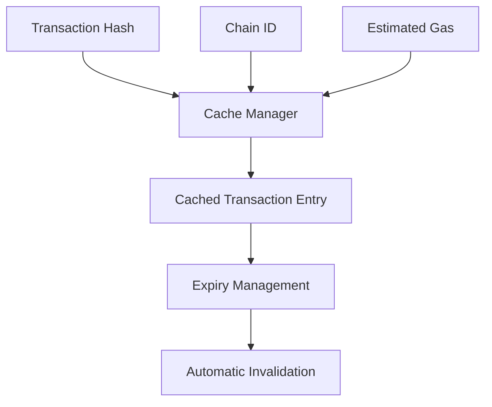

# Paymaster Cache 

A decentralized transaction gas estimation caching system for cross-chain paymaster operations, designed to optimize gas fee prediction and reduce computational overhead.

## Overview

Paymaster Cache creates an efficient, trustless mechanism for:
- Caching transaction gas estimations
- Managing cache expiration and invalidation
- Supporting cross-chain paymaster operations
- Providing lightweight fee estimation services

The system eliminates redundant gas calculations by maintaining a shared, decentralized cache accessible to multiple paymaster services.

## Architecture

The contract provides a comprehensive caching mechanism with key features:



### Core Components
- **Transaction Cache**: Stores gas estimations with metadata
- **Expiry Management**: Automatically invalidates stale entries
- **Administrative Controls**: Secure configuration of cache parameters
- **Cross-Chain Support**: Enables caching across multiple blockchain networks

## Contract Documentation

### Cache Manager (`cache-manager.clar`)

The primary contract managing transaction gas estimation caching:

#### Key Features
- Decentralized transaction gas estimation storage
- Configurable cache entry limits
- Automatic and manual cache entry management
- Cross-chain transaction support

#### Access Control
- Contract administrator manages cache configuration
- Restricted administrative functions
- Secure entry creation and retrieval mechanisms

## Getting Started

### Prerequisites
- Clarinet
- Stacks wallet for testing

### Installation
1. Clone the repository
2. Install dependencies with Clarinet
3. Deploy contracts to local Clarinet chain

### Basic Usage Example
```clarity
;; Cache a transaction gas estimation
(contract-call? .cache-manager cache-transaction 
    0x1234           ;; Transaction hash
    (u1)             ;; Chain ID
    (u100)           ;; Estimated gas
    (u50))           ;; Expiry duration

;; Retrieve cached transaction details
(contract-call? .cache-manager get-cached-transaction
    0x1234           ;; Transaction hash
    (u1))            ;; Chain ID
```

## Function Reference

### Cache Management
```clarity
(cache-transaction 
  (tx-hash (buff 32))
  (chain-id uint)
  (estimated-gas uint)
  (expiry-duration uint))

(get-cached-transaction 
  (tx-hash (buff 32))
  (chain-id uint))

(clear-cache-entry 
  (tx-hash (buff 32))
  (chain-id uint))
```

### Administrative Functions
```clarity
(set-contract-admin (new-admin principal))
(set-max-cache-entries (max-entries uint))
(clear-expired-entries)
```

## Development

### Testing
Run the test suite:
```bash
clarinet test
```

### Local Development
1. Start Clarinet console:
```bash
clarinet console
```

2. Deploy contracts:
```bash
clarinet deploy
```

## Security Considerations

### Limitations
- Relies on block height for cache expiration
- Limited to configured maximum cache entries
- Requires trusted administrator for critical operations

### Best Practices
- Implement periodic cache cleanup
- Set reasonable expiration durations
- Monitor cache usage and performance
- Validate all administrative configuration changes